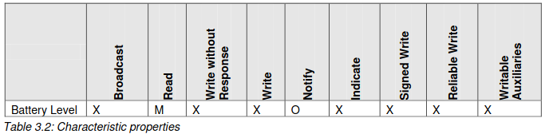

# Laboratoire 4 SYM

> Chris Barros, Vincent Canipel, Jérôme Arn

# Les capteurs

> Une  fois  la  manipulation effectuée,  vous  constaterez  que  les  animations  de  la  flèche  ne  sont  pas fluides,  il  va  y  avoir  un  tremblement plus  ou  moins  important même  si  le  téléphone  ne  bouge  pas. Veuillez expliquer quelle est la cause la plus probable de ce tremblement et donner une manière (sans forcément l’implémenter) d’y remédier.

On peut constater que la précision de certaines données vont jusqu'à six chiffres après la virgule. En faisant quelques tests avec le téléphone placé sur une table sans aucune interactions, nous avons pu constatez les valeurs suivantes pour le capteur Magnétomètre. Les valeurs démontrent que sans changer le téléphone de place, on a des valeurs changeante qui dont des "lags" sur la boussole.

| Axe X     | Axe Y     | Axe Z |
| --------- | --------- | ----- |
| 18.699997 | 14.300003 | -40.6 |
| 18.599998 | 14.199997 | -40.6 |
| 18.800003 | 14.199997 | -40.6 |

Une méthode qui permet d'atténuer ce problème est d'arrondir les valeurs des capteurs. Cela permet seulement d'atténuer car parfois les écarts font changer la valeur d'un paramètre d'une unité. Et cela sans bouger le téléphone. 

# Communication Bluetooth Low Energy

> La  caractéristique  permettant  de  lire  la  température  retourne  la  valeur  en  degrés  Celsius,multipliée par 10,sous la forme d’un entier non-signé de 16 bits. Quel est l’intérêt de procéder de  la  sorte?  Pourquoi  ne  pas  échanger  un nombre  à  virgule  flottante  de  type float par exemple?

L'intérêt se trouve dans l'optimisation de la répresentation de l'information. Cela consiste alors a trouvé un moyen de représenter le plus d'information possible dans le moins de bits possible, tout ça dans le cadre de la température de l'appareil.

Ainsi, on retient plusieurs particularités à la température:
    1- Les valeurs négatives n'ont que très peu d'importance car quasiment impossible.
    2- Les valeurs de température peuvent varier entre 0 et 100 degrés (écart vraiment permissible).
    3- Un chiffre après la virgule est suffisant pour gérer la température de ce genre d'appareil.
Dès lors : 
    1- un entier signé n'a pas d'importance et utilise plus de bits pour coder l'information
    2- 8 bits sont insuffisants car ne permettant pas d'aller à plus de 256 (donc 25.6 très insuffisant) alors on utilise 16 bits
    3- Les flottants nécessitent plus de bits pour coder l'information (gestion de la virgule flottante). Pour une complexité d'un chiffre après la virgule,il est alors préférable de multiplier la valeur par 10 et rester sur un entier. 

Pour conclure, on utilise un entier non-signé car **la température ne peut pas être négative et on utiliserait plus de bits pour un entier signé**. On utilise un entier sur 16 bits car **8 bits sont trop peu pour des températures entre 0 et 100 degrés (maximum 25.6 trop peu)**. On utilise pas de nombre à virgule flottante car **cela nécessiterait plus de bits pour coder l'information alors qu'un complexité d'un chiffre après la virgule suffit amplement et peut être facilement obtenue en divisant la température multiplier par 10**.

> Le niveau de charge de la pile est à présent indiqué uniquement sur l’écran du périphérique, mais nous souhaiterions que celui-ci puisse informer le smartphone sur son niveau de charge restante.Veuillez spécifier la(les) caractéristique(s) qui composerai(en)t un tel service,mis à disposition par le périphérique et permettant de communiquer le niveau de batterie restant via Bluetooth  Low  Energy. Pour  chaque  caractéristique,  vous  indiquerez  les  opérations supportées (lecture, écriture, notification, indication, etc.) ainsi que les données échangées et leur format

Le niveau de charge peut être observer grâce à la caractéristique **battery_level** avec pour **UUID = 2A19** (https://www.bluetooth.com/wp-content/uploads/Sitecore-Media-Library/Gatt/Xml/Characteristics/org.bluetooth.characteristic.battery_level.xml).

**Battery_level** supporte l'écriture (obligatoire) et les notifications (optionnel).

**X**: non permis | **M**: obligatoire | **O**: optionnel
Source: https://www.bluetooth.org/docman/handlers/downloaddoc.ashx?doc_id=245138

La caractéristique envoie **un entier de 0 à 100** représentant **un pourcentage de charge** (0% totalement déchargé, 100% totalement chargé...). L'entier est au format **UInt8**.